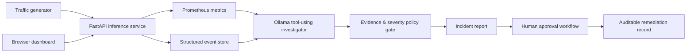

# AegisOps

**A local-first, agentic ML reliability platform for investigating inference incidents with verified evidence and human-approved remediation.**

AegisOps simulates a computer-vision inference API, injects production-style failures, and uses a local Ollama agent to inspect logs and Prometheus metrics before producing an incident report. The model is not trusted as a source of truth: severity, evidence, and allowed remediation options are enforced by deterministic policy.

## Why it exists

ML incidents can surface as service failures, high latency, data drift, or declining prediction confidence. AegisOps demonstrates a safe response pattern:

1. Observe telemetry and structured events.
2. Let an agent select evidence tools and write a diagnosis.
3. Validate operational facts with policy-derived guardrails.
4. Require explicit human approval before a remediation can advance.

## Architecture



## Features

- Simulated inference API with five modes: normal, latency, errors, low confidence, and drift.
- Prometheus-compatible request, latency, confidence, and drift telemetry.
- Structured events with a query endpoint.
- Local, free tool-using agent powered by Ollama and `qwen2.5:3b`.
- Guardrails that keep model-generated prose separate from verified operational facts.
- Human-in-the-loop remediation requests with an approval audit trail.
- Browser dashboard at `/dashboard/`.
- Automated API and workflow tests.
- A LangGraph-orchestrated two-agent pipeline: a tool-using Investigator agent hands off to a separate Reporter agent that only ever sees policy-verified facts, never the Investigator's raw reasoning.
- MLflow experiment tracking (local SQLite backend) logging every investigation's parameters, evidence metrics, severity tag, and generated report as a reproducible run.
- An evaluation harness that scores the agent on two independent axes against simulated ground-truth incidents: policy-derived severity accuracy, and an LLM-judged score of whether the agent's free-text diagnosis names the correct root cause.

## Quick start

### Prerequisites

- Docker Desktop
- Python 3.9+
- [Ollama](https://ollama.com/) with a local model:

```bash
ollama pull qwen2.5:3b
ollama serve
```

The LangGraph and MLflow tooling below should run inside a dedicated virtual environment so their dependencies never collide with other Python projects on your machine:

```bash
python3 -m venv .venv
source .venv/bin/activate
pip install --upgrade pip
pip install -r requirements.txt
pip install langgraph mlflow
```

### Start the service

```bash
docker compose up --build
```

Open the dashboard at [http://localhost:8000/dashboard/](http://localhost:8000/dashboard/).

### Run an end-to-end incident

In a second terminal:

```bash
python3 scripts/generate_traffic.py --requests 20 --fault errors
python3 scripts/agentic_investigator.py
```

The agent must query two independent sources (`get_recent_events` and `get_metrics_snapshot`) before it can complete. The report displays verified metrics separately from the model's diagnosis.

### Run the LangGraph investigator/reporter pipeline (recommended)

`scripts/agentic_graph.py` replaces the single hand-rolled loop above with a real two-agent LangGraph state machine: an **Investigator** node that loops until it has gathered at least two independent evidence sources, and a separate **Reporter** node that makes its own Ollama call and only ever sees the policy-computed facts, never the Investigator's raw reasoning.

```bash
source .venv/bin/activate
python3 scripts/generate_traffic.py --requests 20 --fault drift
python3 scripts/agentic_graph.py
```

Each run is automatically logged to MLflow (see below).

### Experiment tracking with MLflow

Every run of `agentic_graph.py` logs as an MLflow run under the `aegisops_incident_investigations` experiment, tracked in a local SQLite database (`mlflow.db`) so no external service is required:

- **Params:** model name, base URL
- **Metrics:** tool calls made, investigator steps, run duration, observed error rate, drift score, and confidence
- **Tags:** the policy-derived severity
- **Artifacts:** the full generated incident report (`incident_report.md`)

View it with:

```bash
python3 -m mlflow ui --backend-store-uri sqlite:///mlflow.db
```

Then open [http://127.0.0.1:5000](http://127.0.0.1:5000) and switch to the **Model training** tab (not the default GenAI/Tracing tab) to see the classic runs table.

### Evaluation harness

`scripts/eval_harness.py` runs the agent against a set of simulated incidents with **known ground-truth severity and root cause**, restarting the inference service between each scenario so Prometheus counters and the event log start clean for every measurement:

| Fault mode | Expected severity | Expected root cause |
|---|---|---|
| none | low | system healthy, no significant errors or drift |
| errors | high | high rate of upstream/prediction failures |
| low_confidence | medium | unusually low model prediction confidence |
| drift | medium | elevated input data drift |

```bash
source .venv/bin/activate
python3 scripts/eval_harness.py --scenarios 8
```

Each scenario is scored on **two independent axes**, logged as a nested MLflow run under `aegisops_eval_harness`:

1. **Severity accuracy** — does the policy-derived severity (`policy_severity()`, a deterministic function over Prometheus metrics) match the expected ground truth?
2. **Diagnosis accuracy** — a *separate* Ollama call acts as an LLM judge, reading only the Reporter agent's free-text diagnosis (no access to the original evidence) and grading whether it actually names the correct root cause.

**Result from the most recent full run (8 scenarios):**

| Metric | Score |
|---|---|
| Severity accuracy | 8/8 (100%) |
| Diagnosis accuracy (LLM-judged) | 1/8 (12.5%) |

**What this reveals:** severity stayed perfectly reliable specifically *because* it never depends on the LLM's own reasoning being correct — it's computed by a plain policy function reading verified metrics. The Reporter's free-text diagnosis, by contrast, was frequently wrong: it tended to cite every fact it was handed (including metrics sitting at their normal baseline, like a drift score of 0.08) as if they were all contributing causes, rather than distinguishing which values actually indicated a problem. This is empirical evidence for the project's core design decision: **never let an LLM's own conclusions drive operational severity or remediation — gate those behind deterministic, auditable policy logic**, and treat the LLM's prose as an explanation to a human, not a source of truth.

### Submit a human-approved remediation

```bash
python3 scripts/remediation.py create \
  --action route_to_last_known_healthy_model \
  --requested-by satya.pandian \
  --rationale "The error rate exceeded the incident threshold."
```

Copy the returned ID, then use a separate approval action:

```bash
python3 scripts/remediation.py approve \
  --request-id YOUR_REQUEST_ID \
  --approved-by on-call-engineer
```

Approval updates the audit record only. It intentionally does **not** execute a rollback or mutate production infrastructure.

## Test

```bash
docker compose run --rm inference-service pytest -q
```

Or use:

```bash
make test
```

## Project structure

```text
app/main.py                     FastAPI inference, telemetry, and approval API
app/static/index.html           Browser dashboard
scripts/generate_traffic.py     Repeatable incident traffic
scripts/agentic_investigator.py Local tool-using Ollama agent (single-loop)
scripts/agentic_graph.py        LangGraph investigator/reporter pipeline with MLflow logging
scripts/eval_harness.py         Ground-truth accuracy evaluation across simulated incidents
scripts/remediation.py          Remediation request and approval CLI
tests/test_main.py              API and workflow tests
```

## Safety design

The local model can choose tools and write a diagnosis, but it cannot execute remediations. Evidence, severity, and remediation options are calculated from tool output, and every remediation must be explicitly approved and recorded.
