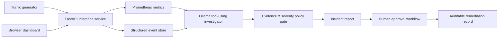

# AegisOps

**A local-first, agentic ML reliability platform for investigating inference incidents with verified evidence and human-approved remediation.**

AegisOps simulates a computer-vision inference API, injects production-style failures, and uses a local Ollama agent to inspect logs and Prometheus metrics before producing an incident report. The model is not trusted as a source of truth: severity, evidence, and allowed remediation options are enforced by deterministic policy.

## Why it exists

ML incidents can surface as service failures, high latency, data drift, or declining prediction confidence. AegisOps demonstrates a safe response pattern:

1. Observe telemetry and structured events.
2. Let an agent select evidence tools and write a diagnosis.
3. Validate operational facts with policy-derived guardrails.
4. Require explicit human approval before a remediation can advance.

## Architecture



## Features

- Simulated inference API with five modes: normal, latency, errors, low confidence, and drift.
- Prometheus-compatible request, latency, confidence, and drift telemetry.
- Structured events with a query endpoint.
- Local, free tool-using agent powered by Ollama and `qwen2.5:3b`.
- Guardrails that keep model-generated prose separate from verified operational facts.
- Human-in-the-loop remediation requests with an approval audit trail.
- Browser dashboard at `/dashboard/`.
- Automated API and workflow tests.

## Quick start

### Prerequisites

- Docker Desktop
- Python 3.9+
- [Ollama](https://ollama.com/) with a local model:

```bash
ollama pull qwen2.5:3b
ollama serve
```

### Start the service

```bash
docker compose up --build
```

Open the dashboard at [http://localhost:8000/dashboard/](http://localhost:8000/dashboard/).

### Run an end-to-end incident

In a second terminal:

```bash
python3 scripts/generate_traffic.py --requests 20 --fault errors
python3 scripts/agentic_investigator.py
```

The agent must query two independent sources (`get_recent_events` and `get_metrics_snapshot`) before it can complete. The report displays verified metrics separately from the model's diagnosis.

### Submit a human-approved remediation

```bash
python3 scripts/remediation.py create \
  --action route_to_last_known_healthy_model \
  --requested-by satya.pandian \
  --rationale "The error rate exceeded the incident threshold."
```

Copy the returned ID, then use a separate approval action:

```bash
python3 scripts/remediation.py approve \
  --request-id YOUR_REQUEST_ID \
  --approved-by on-call-engineer
```

Approval updates the audit record only. It intentionally does **not** execute a rollback or mutate production infrastructure.

## Test

```bash
docker compose run --rm inference-service pytest -q
```

Or use:

```bash
make test
```

## Project structure

```text
app/main.py                     FastAPI inference, telemetry, and approval API
app/static/index.html           Browser dashboard
scripts/generate_traffic.py     Repeatable incident traffic
scripts/agentic_investigator.py Local tool-using Ollama agent
scripts/remediation.py          Remediation request and approval CLI
tests/test_main.py              API and workflow tests
```

## Safety design

The local model can choose tools and write a diagnosis, but it cannot execute remediations. Evidence, severity, and remediation options are calculated from tool output, and every remediation must be explicitly approved and recorded.
